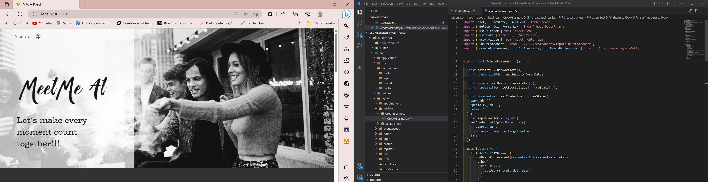

# Welcome to Meet Me At Frontend app  
<p aling="center"></p>

<details>
  <summary>Index</summary>
  <ol>
    <li><a href="#meet-me-at-app">About Meet Me At app</a></li>
    <li><a href="#stack">Stack</a></li>
    <li><a href="#local-instalation">Local installation</a></li>
    <li><a href="#how-i-have-done-it">How I done it</a></li>
    <li><a href="#project-structure">Project structure</a></li>
    <li><a href="#known-bugs">Known bugs</a></li>
    <li><a href="#future-functionalities">Future funtionalities</a></li>
    <li><a href="#licence">Licence</a></li>
    <li><a href="#webgraphy">Webgraphy</a></li>
    <li><a href="#contact">Contact</a></li>
  </ol>
</details>

## Meet Me At App

<p align="center">"Meet Me At" was created to meet the demand for several needs. Our world has changed as a result of the pandemic, we have dismissed relationships, and many work environments are remote. With all this, I have wanted to help people reconnect, to promote communication and interaction between people (which could help improve relationships and reduce the feeling of isolation that many have experienced).

I believe that it is a platform that can improve mental health and emotional well-being, by offering a variety of events and activities that promote well-being and social connection, it can help people deal with the stress and anxiety caused by the current pace of life.

"Meet Me At" establishes connections between businesses and users, making it possible for the businesses to present their events and users to sign up for those that they find attractive. In this way, the application promotes the formation of a community made up of people with similar interests. Likewise, thanks to the event management tools it provides, the platform helps companies and organizers coordinate and keep participants up-to-date on event details. 

"Meet Me At" is presented as a valuable and useful tool for those seeking to connect with others and participate in exciting events.</p>


## Stack
<div align="center">
<a href="https://www.reactjs.com/">
    
</a>
<a href="https://developer.mozilla.org/es/docs/Web/JavaScript">
    
</a>
 <a href="https://redux.js.org/">
    
</a>
<a href="https://react-bootstrap.github.io/">
    
</a>
<a href="https://nodejs.org/en">
    
</a>
<a href="https://github.com/">
    
</a>
<a href="https://git-scm.com/downloads">
    
</a>
<a href="https://aws.amazon.com/es/">
    
</a>
<a href="https://developer.mozilla.org/es/docs/Web/CSS">
    
</a>
<a href="https://nextjs.org/">
    
</a>
<a href="https://expressjs.com/">
    
</a>
<a href="https://www.sequelize.org/">
    
</a>

## Local installation
####This is for backend project:

  And follow the next steps:

 1.Clone the project on your computer
    ` $ git clone 'url-repository' `
 2.Install all dependencies
    ` $ npm install `
 3.Create a .env with the credentials on the .env.example
 4.Start server with:
   ``` $ npm run dev ```
 5.Connect with the database following:
    ``` $ npx sequelize-cli db:create ```
    ``` $ npx sequelize-cli db:migrate ```
    ``` $ npx sequelize-cli db:seed:all ```
######Now is time for frontend project:
 1.Clone the project on your computer
    ` $ git clone 'url-repository' `
 2.Install all dependencies
    ` $ npm i `
 3.Start server with:
   ``` $ npm run dev ```

Last step download the dataBase:

 [DataBase GitHub](https://github.com/LauraSanchezLucas/lsl-MeetMeAt-Final-Project-GeeksHubs)

## How I have done it
For the Meet Me At app, I have implemented various technologies mentioned in my "Stack", such as JavaScript, NodeJS, React, etc. First, I created a plan to approach my project in terms of the requirements I wanted to have it and marked all the endpoints of the project, as can be seen in the following image:


Once I created the project, I started by connecting the frontend with the backend and then began manipulating the data to render it in my project. Next, I designed the visual part through Bootstrap React. 
During the process, I had some complications, such as manipulating modal windows that did not close automatically or not being able to open a second modal from the first modal. I solved this by putting the entire view inside the modal. Additionally, when implementing the search filter, I encountered an infinite loop issue, so I had to restructure the code by introducing a new condition in the part of fetching all the users.

Finally, I worked on the user interface attractive and easy to use, so that any user, whether an administrator, a public user, or a company, could access all the proposed functionalities for the project. Lastly, I added some additional features, such as the ability to send a message to the admin when registering as a business through emailJS.

## Project structure

The structure of this project starts with an index.html file, which is the first file that the program uses, and it connects to other files. First, there's the main.jsx file, which connects to the rest of the files using react-dom and react-router-dom and this file defines the basic structure that each design will have, while the MainApp.jsx file declares and connects the routes of the project. The routes are grouped into designs, which are in a folder called "layouts" in the “src” repository. 
In the "application" folder, there's the store.js file, which is essential for the operation of Redux, and it connects to fragment files. 
In the "components" folder, reusable elements are stored that can be used in several designs, such as the "input-component". 
Finally, in the "services" folder, there's the file responsible for communicating with the backend using axios, while the validations file can be found in the "helpers" folder.

## Known bugs
 The knowns bugs in my platform are the folllowing:
    -   It does not display messages indicating that a user or event is already registered, or if a business already exists.
    -   Block or hide the button if you have already signed up for an event or remove the event from your list.
    -   The photos are too heavy and slow down the website's performance, so it would be advisable to have different types of formats available.
    -   The logo does not hide in the companies and services section in the home view.

## Future funtionalities
The following features will be implemented in the future:
        -   Update event by business or admin.
        -   Update role by admin.
        -   Update notes from business by admin.
        -   Cancel a specific user from an event by a business.
        -   Limit the number of users for an event.
        -   Notify registered users of an event via email in case of any updates or modifications.
        -   Allow a user to view past and future events in their appointments side.

## Licencia
This project is belonging to license Creative Commons Legal Code.

## Webgrafia:
To achieve the goal we have collected information from:

[React documentation](https://www.reactjs.com/)
[React-bootstrap GeeksHubs](https://react-bootstrap.github.io/)
[eventbrite-website](https://www.eventbrite.es/d/spain--valencia/events/)
[website-meetup](https://www.meetup.com/es-ES/)
[website-freepik](https://www.freepik.es/)
[website-emailJS](https://www.emailjs.com/)


## Contacto

<a href = "laura:lausnclu@gmail.com"></a>
<a href="https://www.linkedin.com/in/laura-sanchez-lucas-5b2222251" target="_blank"></a>
<a href="https://github.com/LauraSanchezLucas" target="_blank"></a>